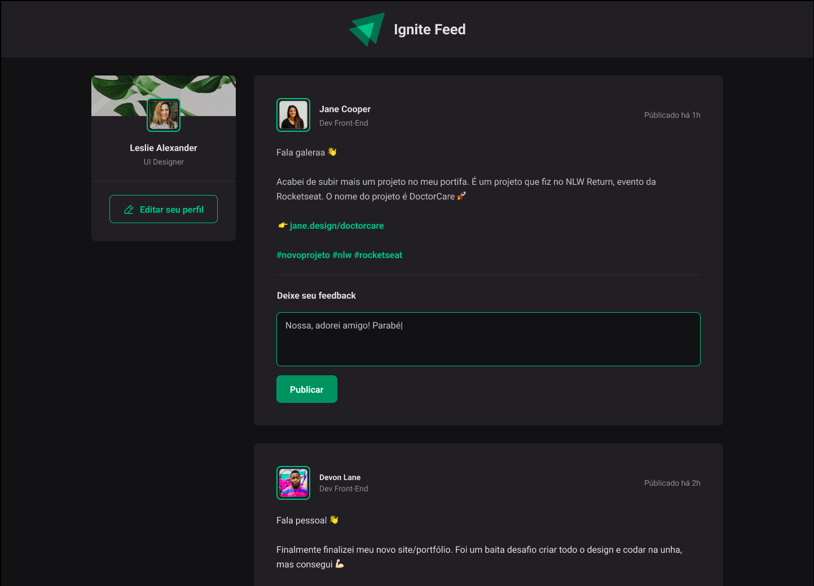

<h1 align="center">Ignite Feed</h1>

Projeto desenvolvido durante o primeiro módulo da [Trilha Ignite](https://www.rocketseat.com.br/ignite) da [Rocketseat](https://www.rocketseat.com.br/)

## 🖥️ Projeto

 

## 🚀 Tecnologias

Nesse módulo, foi criado uma aplicação React utilizando o Vite e aprendi sobre os conceitos mais importantes do React, entre eles estão:

- Componentização 
- Propriedades 
- Estados
- Imutabilidade 
- Hooks 

Além de aplicar o TypeScript no nosso projeto para adicionar tipagem estática à aplicação.

 

## 🏷️ Layout

Você pode visualizar o layout do projeto através
[desse link](https://www.figma.com/file/vmB9OCkDYfbF0HuKmwN2Eh/Ignite-Feed-(Community)-(Copy)?type=design&node-id=0%3A1&t=30Rvxi1vBPS0czG2-1).
É necessário ter uma conta no [Figma](https://www.figma.com)

## 💬 Me encontre nas redes

